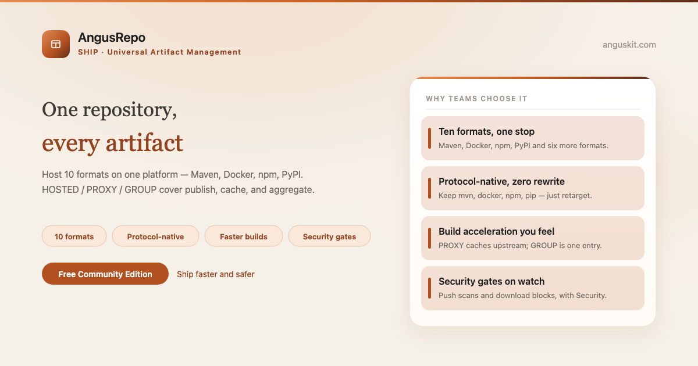
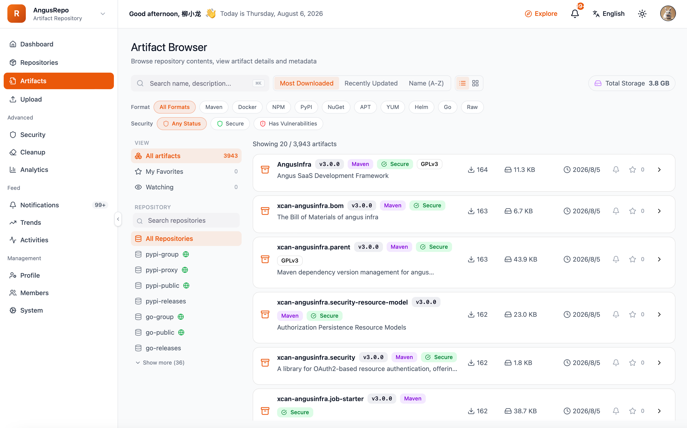

**English** | [简体中文](README.zh.md)

<p align="center">
  
</p>

<p align="center">
  <a href="https://www.anguskit.com/en/pricing"></a>
  <a href="LICENSE"></a>
  <a href="https://www.anguskit.com/en/docs/repo"></a>
  <a href="https://www.anguskit.com"></a>
</p>

# AngusRepo

**One Repo, All Artifacts. Ship Software Faster & Safer.**

Universal Artifact Management — the Ship product in [AngusKit](https://github.com/AngusKit/AngusKit).

> **This repository hosts documentation only.** AngusRepo source code is distributed through private deployment packages, not through this GitHub repository. Earlier revisions of this repository contained application source; as of this update, distribution has moved to AngusKit's packaging pipeline (see [Get the Community Edition](#get-the-community-edition-free) below). This repository now focuses on product information, quickstart guides, and links to the full documentation site.

## What is AngusRepo

AngusRepo hosts 10 mainstream artifact formats (Maven, npm, Docker, PyPI, and more) on one platform, pulling publishing, caching, aggregation, and permissions onto a single control plane — so artifacts stay traceable and governable from build to release.

## Key capabilities

- **Multi-protocol, one repo** — Maven, npm, Docker, PyPI, and more, hosted side by side
- **Protocol-native access** — clients talk to native protocol endpoints, no client-side rewrites
- **ACL & tokens** — fine-grained access control and token-based auth per repository
- **Proxy cache acceleration** — proxy upstream public registries with a local cache
- **Supply-chain security gates** — gate artifact promotion on security findings
- **Private & auditable** — every pull/push stays inside your infrastructure with an audit trail

## Screenshot

<p align="center">
  
</p>

## Get the Community Edition (free)

```bash
curl -LO https://repo.anguskit.com/raw/raw-public/AngusKit/repo/AngusRepo-Community-1.0.0.zip
unzip AngusRepo-Community-1.0.0.zip
cd AngusRepo-1.0.0/docker
cp env.example .env
docker compose --profile mysql up -d
```

- Minimum: **2 cores / 4 GB** (recommended: 4 cores / 8 GB); disk 100 GB, dedicated artifact disk recommended
- Ports after install: AngusGM `8801` (sign-in), AngusRepo `8804` (console + all protocol endpoints)
- Only need AngusRepo? This zip includes AngusRepo + AngusGM — no other product required.

Full installation guide (host ZIP, Kubernetes/Helm, TLS, upgrades): **[docs.anguskit.com/repo](https://www.anguskit.com/en/docs/repo/latest/en/manual/02-installation)**

## Community vs. Team / Enterprise vs. SaaS

| | Community | Team / Enterprise | SaaS |
|---|---|---|---|
| Price | Free | Paid, private deployment | Paid, hosted |
| Users | Up to 10 | Higher / unlimited seats | Per plan |
| Artifact repositories | Up to 50 | Higher / unlimited | Per plan |
| Artifact storage | Self-managed | Self-managed or pooled | Per plan |
| Security gates, SBOM, MCP | Not included | Included | Per plan |

Community Edition source is licensed under GPL-3.0 and distributed with each Community installation package. Team and Enterprise editions are proprietary, governed by the **XCan Business License, Version 1.0**, distributed only under a paid subscription.

Full pricing and feature comparison: **[anguskit.com/pricing](https://www.anguskit.com/en/pricing)**

## Related AngusKit products

| Product | Focus | Repository |
|---|---|---|
| AngusKit | The full suite (this product + 5 others + AngusGM) | [AngusKit/AngusKit](https://github.com/AngusKit/AngusKit) |
| AngusAI | AI agent development | [AngusKit/AngusAI](https://github.com/AngusKit/AngusAI) |
| AngusGit | AI-native code collaboration | [AngusKit/AngusGit](https://github.com/AngusKit/AngusGit) |
| AngusTester | AI-native software testing | [AngusKit/AngusTester](https://github.com/AngusKit/AngusTester) |
| AngusSecurity | Application security & governance | [AngusKit/AngusSecurity](https://github.com/AngusKit/AngusSecurity) |
| AngusInsight | Private product analytics | [AngusKit/AngusInsight](https://github.com/AngusKit/AngusInsight) |

## Documentation & support

- Full docs: [anguskit.com/docs/repo](https://www.anguskit.com/en/docs/repo)
- Contact / sales: [anguskit.com/contact](https://www.anguskit.com/en/contact) · `sales@anguskit.com`
- This repository's Issues are for **documentation feedback and install troubleshooting**. This repository does not accept source code pull requests — see [CONTRIBUTING.md](CONTRIBUTING.md).

## License

- This repository's documentation content: see [LICENSE](LICENSE) (GPL-3.0, matching the Community Edition source it describes).
- AngusRepo Community Edition product source: GPL-3.0, distributed with each Community installation package.
- AngusRepo Team / Enterprise Edition: proprietary, XCan Business License v1.0, distributed under a paid subscription only.
