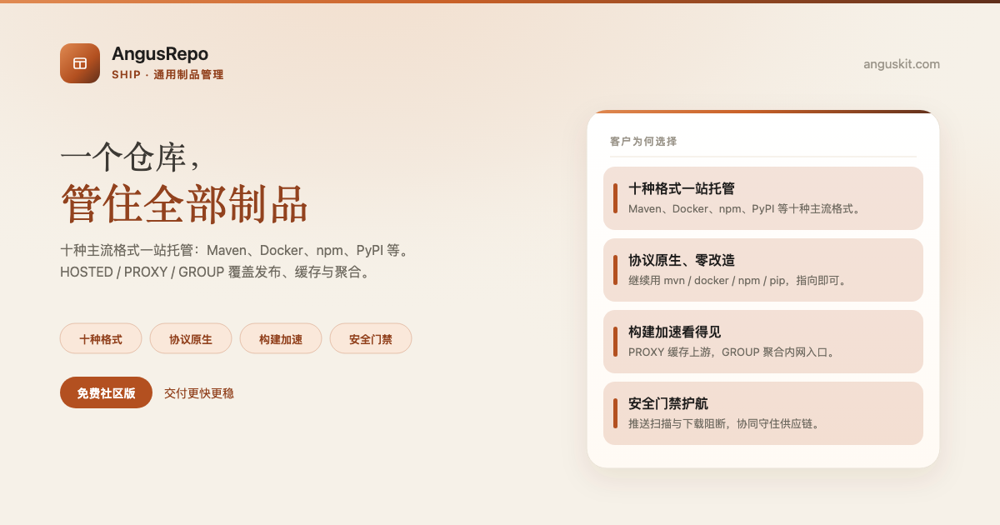
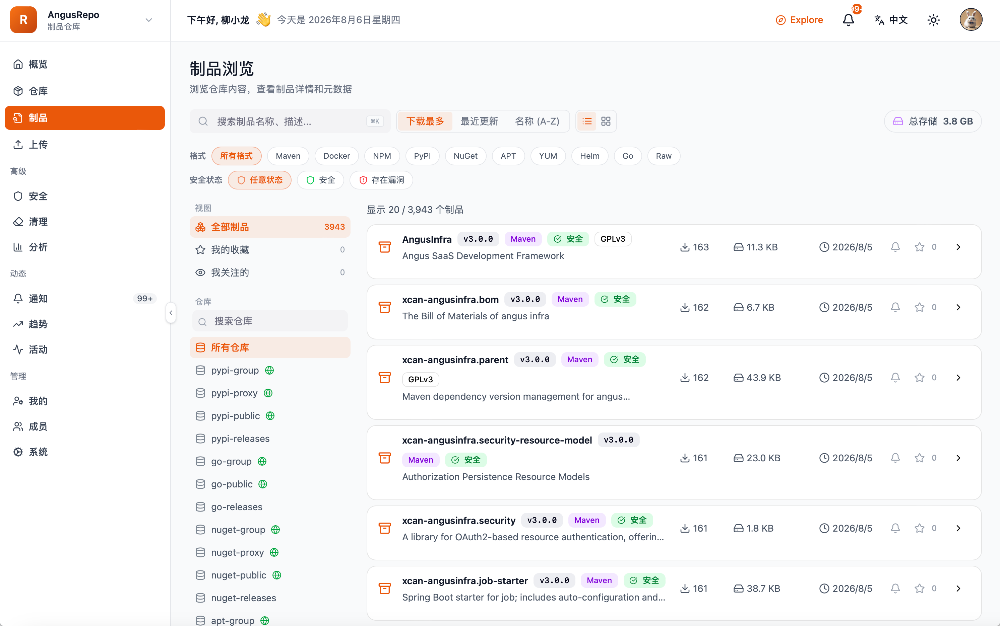

[English](README.md) | **简体中文**

<p align="center">
  
</p>

<p align="center">
  <a href="https://www.anguskit.com/zh/pricing"></a>
  <a href="LICENSE"></a>
  <a href="https://www.anguskit.com/zh/docs/repo"></a>
  <a href="https://www.anguskit.com"></a>
</p>

# AngusRepo

**一个仓库，管住所有制品：交付更快，也更安全。**

通用制品管理——[AngusKit](https://github.com/AngusKit/AngusKit) 中负责 Ship 的产品。

> **本仓库仅承载文档内容。** AngusRepo 的产品源码通过私有化安装包分发，不在本 GitHub 仓库公开。本仓库此前版本曾包含应用源码；本次更新后，源码分发已统一收拢到 AngusKit 的打包发布流水线（见下文「免费获取社区版」）。本仓库现聚焦于产品信息、快速上手指引，以及指向完整文档站的链接。

## AngusRepo 是什么

AngusRepo 在一个平台上统一托管 Maven、npm、Docker、PyPI 等 10 种主流制品格式，把发布、缓存、聚合与权限收到同一控制面，让制品从构建到上线全程可追溯、可治理。

## 核心能力

- **多协议一仓**——Maven、npm、Docker、PyPI 等格式同台托管
- **协议原生接入**——客户端直连原生协议端点，无需改造
- **权限与令牌**——按仓库粒度的细粒度访问控制与令牌鉴权
- **代理缓存加速**——代理上游公共仓库并本地缓存加速
- **供应链安全门禁**——按安全检测结果对制品晋级设门禁
- **私有化与可审计**——每一次拉取/推送全程留在你的基础设施内，带审计留痕

## 产品截图

<p align="center">
  
</p>

## 免费获取社区版

```bash
curl -LO https://repo.anguskit.com/raw/raw-public/AngusKit/repo/AngusRepo-Community-1.0.0.zip
unzip AngusRepo-Community-1.0.0.zip
cd AngusRepo-1.0.0/docker
cp env.example .env
docker compose --profile mysql up -d
```

- 最低配置：**2 核/4 GB**（推荐 4 核/8 GB）；磁盘 100 GB，建议使用独立制品盘
- 安装完成后端口：AngusGM `8801`（登录入口）、AngusRepo `8804`（控制台 + 全部协议端点）
- 只需要 AngusRepo？这份 zip 已包含 AngusRepo + AngusGM，无需其它产品。

完整安装指南（主机 ZIP、Kubernetes/Helm、TLS、升级）：**[docs.anguskit.com/repo](https://www.anguskit.com/zh/docs/repo/latest/zh/manual/02-installation)**

## 社区版 vs 团队版/企业版 vs SaaS

| | 社区版 | 团队版/企业版 | SaaS |
|---|---|---|---|
| 价格 | 免费 | 付费，私有化部署 | 付费，云端托管 |
| 用户数 | 最多 10 | 更高/不限席位 | 按套餐 |
| 制品仓库数 | 最多 50 | 更高/不限 | 按套餐 |
| 制品存储 | 自管 | 自管或统一配额 | 按套餐 |
| 安全门禁、SBOM、MCP | 不含 | 包含 | 按套餐 |

社区版源码使用 GPL-3.0 协议，随社区版安装包一同分发。团队版与企业版为专有软件，受 **XCan Business License, Version 1.0** 约束，仅随付费订阅提供。

完整定价与功能对照：**[anguskit.com/pricing](https://www.anguskit.com/zh/pricing)**

## AngusKit 关联产品

| 产品 | 定位 | 仓库 |
|---|---|---|
| AngusKit | 完整套件（本产品 + 其它 5 个 + AngusGM） | [AngusKit/AngusKit](https://github.com/AngusKit/AngusKit) |
| AngusAI | AI 智能体开发 | [AngusKit/AngusAI](https://github.com/AngusKit/AngusAI) |
| AngusGit | AI 原生代码协作 | [AngusKit/AngusGit](https://github.com/AngusKit/AngusGit) |
| AngusTester | AI 原生软件测试 | [AngusKit/AngusTester](https://github.com/AngusKit/AngusTester) |
| AngusSecurity | 应用安全与治理 | [AngusKit/AngusSecurity](https://github.com/AngusKit/AngusSecurity) |
| AngusInsight | 私有化产品分析 | [AngusKit/AngusInsight](https://github.com/AngusKit/AngusInsight) |

## 文档与支持

- 完整文档：[anguskit.com/docs/repo](https://www.anguskit.com/zh/docs/repo)
- 联系/销售：[anguskit.com/contact](https://www.anguskit.com/zh/contact) · `sales@anguskit.com`
- 本仓库的 Issues 仅用于**文档反馈与安装排查**。本仓库不接受源码 Pull Request，详见 [CONTRIBUTING.md](CONTRIBUTING.md)。

## License

- 本仓库文档内容：见 [LICENSE](LICENSE)（GPL-3.0，与其描述的社区版源码保持一致）。
- AngusRepo 社区版产品源码：GPL-3.0，随每个社区版安装包分发。
- AngusRepo 团队版/企业版：专有软件，XCan Business License v1.0，仅随付费订阅提供。
